# Abstract

Fractal growth is a computationally intensive simulation which has typically ignored traditionoal first principles in physics in order to increase speed. Lightning is a well understood phenomena that can be simulated accurately with the Dielectric Breakdown Model, but it is computationally expensive to do so. We seek to optimize this simulation with HPC through the parallelization of the simualtion at each time step using a multi-core and -node architecture on Google Cloud Engine. Using this approach, we obtained a non-trivial speedup and amanged to simulate lightning growth on a 1400x1400 grid.


# Problem Statement
One of the biggest promises of HPC is allowing for realistic modelling of the physical world. This pursuit is nontrivial, as physical descriptors of nature often require high-dimensional space, big data, and intensive computations that do not scale well as spatial or temporal resolution are increased. Models often trade off performance for accuracy as they grow in complexity. One such domain is the use of computing to simulate lightning dispersion as is nucleates from a point in the air towards the ground. These models either rely on naive toy models that essentially propagate a point towards the ground randomly, or physical models that rely on electrodynamics and fractal growth to efficiently simulate lightning dispersion. The aim is to implement the physical model through first principles while offseting some of the computing and scaling bottlenecks through HPC principles. 

Fractal growth is a computationally intensive simulation which has typically ignored traditionally first principles in physics in order to increase speed despite the fact that these growth patterns can be found in a wide-range of of phenomenon from biology to physics and chemistry. Lightning is a well understood phenomena that can be simulated accurately with the Dielectric Breakdown Model, but it is computationally expensive to do so. This model relies on solving discretized differential equations on enormous grids with unfavorable scaling. This has bottlenecked any sort of physical implementation. 

In order to accurately simulate lightning based on first-principles, the Dielectric Breakdown Model is used. In this method, the charge distribution over a given grid is calculated by solving the Poisson equation. However, solving this partial differential equation is compuataionally expensive, requiring an expansion of the grid used. In order to solve for the growth at each time step on a 100 x 100 grid, one must solve for the dot product of a 10,000x10,000 matrix and a 10,000 element vector (or another square matrix). Obviously, this  scaling is inefficient but luckily matrix operations are easily parallelizable in theory. 


# Previous Work

Lightning is a form of electric discharge and grows in a fractal pattern. This occurs when there is a a large enough large enough potential difference between two objects. In many cases, and in the case of our simulations, this is the difference in a cloud of electrons and the ground. It begins with an initial negative charge distribution, the initial breakdown and then expands to another point, creating another breakdown. This extension from the initial breakdown to the point with the largest difference is known as the stepped leader. The entire process is quick; it only takes around 35ms (). However, the process rapidly iterates with the negative charges of the first stepped leader laying the groundwork for subsequent bolts. Each bolt follows in the path of . the previous, albeit much faster (1-2ms) given the bias of the first stepped-leader. Moreover,  given the fractal pattern lightning ultimately achieves, it is classified as Laplacian growth. This is critical to much early work as Laplacian growth is a well understood concept and many approaches can yield accurate shapes. These two features of lightning, stepped leader behavior and laplacian growth, are the two primary targets of previous work in the area. 

In the past, lightning simulations  have been forced to choose between two paradigms: accurate models or efficient models. In accurate modeling, first-principles are used in order to more-accurately depict the growth of a lightning ray. However,  as mentioned above, this typically result in computationally slow models. On the other hand, lightning growth can be simulated for human observation simply by approximating the shape. These models are appealing to look at, and can grow quite large, but often lack any form of phyciscal principle: they are just fast and generate results that resemble lightning. 

## Diffusion Limited Aggregation (DLA)

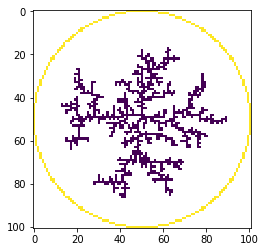
<center> Fig. 1. DLA-generated lightning </center>

To simulate only the shape, one possible appraoch is diffusion limited aggregation (DLA). In this method, there are five critical steps to understand:

1. A point charge is distributed randomly on a grid of an arbitrary size.
2. A second point is randomly chosen on the grid to begin a random walk. 
3. The second point is allowed to walk until it is within one grid-space of the initial charge.
4. With some probability , the walker "sticks" to the charge. If it does not stick, it is allowed to continue to walk.
5. The process is repeated until the given number of "steps" (walks) have occurred.

Using the above method, one is able to accurately simulate the growth of fractal patterns and laplacian growth. The model is incredibly fast on small, two-dimension girds, as the computer must only randomly draw the direction of the random walk. This allows for rapid simulations compared to other methods, taking only 120 seconds on a 256 x 256 grid.

However, the model breaks down in two critical ways: it scales poorly and it does not accurately simulate the shape of lightning (see below image). Given the model is essentially a series of random walks, it takes far longer on larger grid sizes and even worse in high-dimension spaces. The root mean squared distance a random walk travels is actually the square root of the number of time steps in one dimension. 

In two dimensions, the walk takes even longer given there are now two axes to walk along. In three, it is even more difficult for a random walk to "stick to" the initial charge as it has to probabalistically reach the single point in an ever-expanding space.

The second criticism of the model can be remedied with tip-biasing, an approach developed to specifically model lightning's directionally-biased nature. In tip-biased DLA, the probability of the walker starting from a given point is inversely correlated with its distance from the tip of the stepped leader. It does not force the lightning in one direction, but allows it to grow in that direction with a greater probability. A normal distribution models the probability of starting from a point  spaces from the tip, with the probability maximized at . A sample distribution for k =  3 is shown below:


| Distance    | 0 |  1 |  2 | 3 |  4 |  5 | 6 |
|-------------|---|--|--|-----|--|--|---|
| Probability | 0 | .1 | .2 |   .4  | .2 | .1 | 0 |

<center> Fig. 2. Distance-probability distribuion of tip-biased DLA </center>

This also helps remedy the scaling issue as the tip-bias dictates the random walk does not have to walk nearly as far. Thus,  the method helps to remedy the two aforementioned issues with DLA, but still does not take into account physical first-principles. 

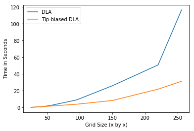
<center> Fig. 3. DLA times for various grid sizes </center>


The above figure is a comparison of runtimes for tip-biased DLA and normal DLA runtimes.


<center> Fig. 4. Tip-biased DLA output </center>


In the above image, the extreme branching pattern of tip-biased DLA can be seen, far less accurate than other methods in terms of shape, but still not as inaccurate as normal DLA.


## Dielectric Breakdown Model

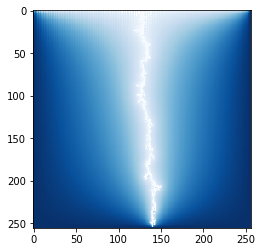
<center> Fig. 5. DBM-generated lightning </center>

The dielectric breakdown model is a method for simulating lightning with first-principles in mind. The algorthm can be summarized in the following steps:

1. Randomly select an initial charged point on a grid.
2. Solve a discretization of the Poisson equation to determine the potential grid and determine the charge difference between the stepped leader and all points on the grid. 
3. The largest differences on the grid are the most probable to be the grids to which the stepped leader "jumps." This is considered a "step."
4. Repeat steps 2 and 3 until the lightning reaches the "ground" (bottom of the grid).

Step two is the most computationally intensive. In order to calculate the potential grid from the initial point to the ground, we must solve  the Laplacian equation, derived from Maxwell's equations for an electric field:


With two-dimensional finite-differences, we have:

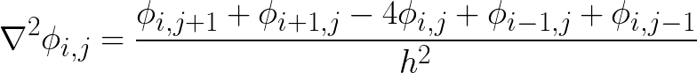
    
From the above, we get an equation for each point on the grid, meaning we get  linear equationos for an  grid.  is a dense vector of length . This can be represented as the matrix product: 

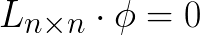

This system of linear equations is where we get the  complexity we see in the computational runtimes. With a grid of 128, we get  equations and thus have a  matrix. 


We can use numerous techniques to solve this, but in the current implementation, we use the Incomplete Poisson Conjugate Gradient (IPCG) method (pseudocode below). This method is similar to the Incomplete Cholesky Conjugate Gradient (ICCG) method but uses a Poisson-specific preconditioner. 

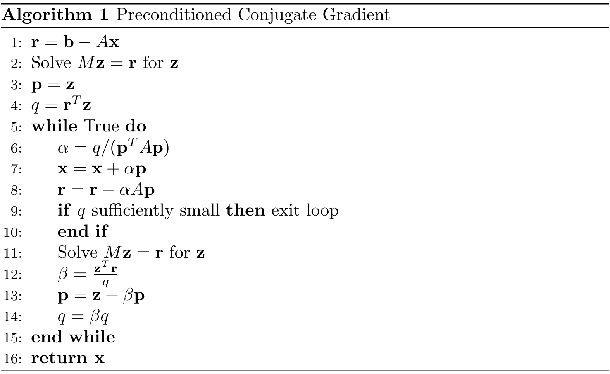


The intricacies of the above approach are not critical to understand in the context of this paper. Essentially, the above method and the Poisson preconditioner allow for only a single matrix muliplication operation is needed at a given iteration of the conjugate gradient. The preconditioner ensures convergence and thus accelerates the simulation of lightning. 
The intricacies of the above approach are not critical to understand in the context of this paper. Essentially, the above method and the Poisson preconditioner allow for only a single matrix muliplication operation is needed at a given iteration of the conjugate gradient. The preconditioner ensures convergence and thus accelerates the simulation of lightning. 

The probability of a given point being the next point the stepped leader jumps to is directly proportional to its charge:

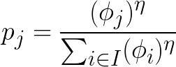

 is a branching hyperparameter. For the purposes of this report, it is not relevant but it essentially controls the probability of branching in the simulation.  A greater  value dictates a straighter stepped leader. The value used in these simulations is 4. 

However, as with DLA, this method scales poorly with problem size as the linear equation solution gets more and more complicated.

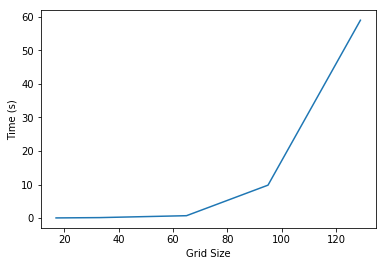
<center> Fig. 6. DLA-generated lightning </center>


# Model Origins

The above methods, tip-biased DLA and DBM with IPCG were both implemented for the final project of AM205. However, these methods proved to be both incredibly memory intensive and computationally slow. Simulting square grids larger than 500 points proved difficult without extremely powerful virtual machine instances and many hours of computation.  When implemented, High Performance Computing was not considered and all simulations were generated on local machines. As such, selecting these models to apply HPC to was a logical decision.

However, after some initial analysis, it appeared DBM was a far better candidate for optimization than DLA. The reason for this is simple: DLA is extermely sequential. The two processes, stepped leader growth and random walks, both explicitly rely on previous steps.  The next step of the growth leader cannot be predicted without the last and the process of a random walk implicitly depends on previous steps in the random walk to calculate the next. As such, DLA was discarded.

With DBM, there is still an explicit dependence from step to step, but the process of determining the next step of the stepped leader at a given timepoint is not sequential in nature. In DLA, a random walk, the method of determining the next step, cannot be parallelized but in DBM the solving of the linear equation can be. Thus, we focused our efforts on this equation. 


# Goal

Rendering visually appealing lightning is the goal and as such we needed to generate lightning on a 1400x1400 grid, which is similar to the resolution of standard HD screens (1920×1080). Ultimately, our we sought to optimize this simulation with HPC through the parallelization of the simulation along the time domain using a multi-thread, multi-node architecture on Google Cloud Engine and Amazon Web Services. Using this approach, we obtained a non-trivial speedup with different paradigms and managed to simulate lightning growth on up to a 1400x1400 grid. 

# Profiling

An important first step was profiling. Contrarily to other projects which started from the ground up, our goal was to optimize an existing codebase. Even though our intuition led us to believe that we should first parallelize complex matrix operations like matrix multiplications, it was crucial to profile existing code determine performance bottlenecks. This investigative work was crucial, as it turned out that one operation that we took for granted was in fact monopolizing almost 50% of the total execution time!

Initial profiling of the code revealed a massive bottleneck in the dot product used in the IPCG method. This method accounted for over 40% of the computation time and scaled poorly with grid size. Thus, we sought to optimize this step in particular. However, we quckly ran into a problem with this approach: the operation was already highly optimized.

During the original implementation of DBM, the choice was made to use sparse matrices to drastically increase the speed of matrix operations, and inversely to reduce the memory footprint. This accomplished the goal of speeding up operations, but also meant our baseline code was already extremely fast. Moreover, we leveraged the numpy library further speedup the operations. Under the hood, numpy compiles in C++ and parallelizes many basic operations. We realized that while monitoring the CPU usage of the baseline algorithm; it would spike beyond what a single-core algorithm could possibly achieve. Indeed, we could see its usage reaching 300 to 400% while running locally. Later on in the project, we ran the baseline algorithm on a 96-core machine, and using monitoring tools like *top* we measured a CPU usage of 6,938%! Thus, for all intents and purposes, the code was already semi-parallelized.

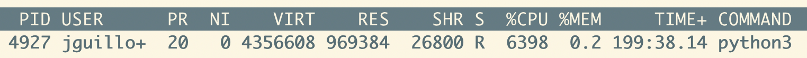
<center> Fig. 7. CPU usage while running baseline algorithm on 96-core machine </center>

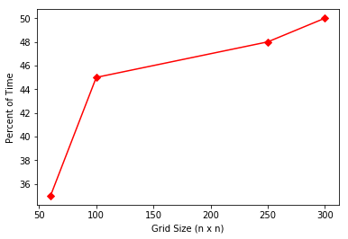
<center> Fig. 8. Grid-size vs percent of total time for matrix-vector dot product </center>

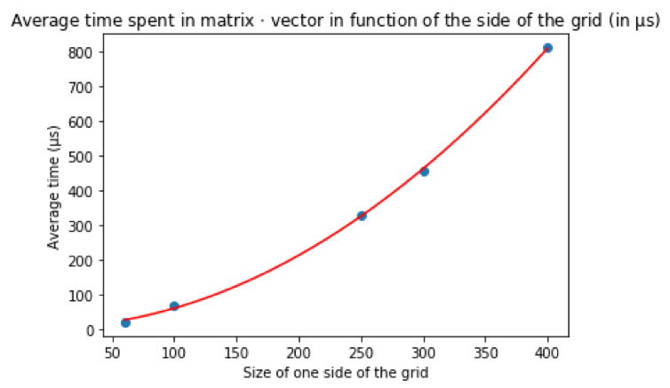
<center> Fig. 9. Average time in matrix-vector dot product for various grid sizes </center>

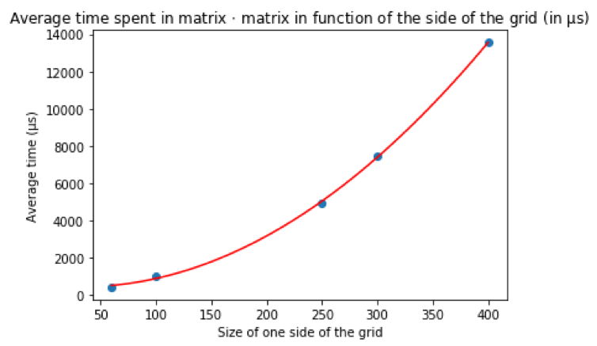
<center> Fig. 10. Average time in matrix-matrix dot product for various grid sizes </center>

On top of that, the bottleneck was not due to the operation taking a long time to complete, but rather the sheer number of calls (see Table 1). On a 100x100 grid, the mat-vec dot product does take 6.19s, but it is called 88,200 times (for an average time of only ); on 250x250 grids, it is called 362,086 times; on 400x400 grids, over 400,000 times, averaging . In terms of execution time per call, mat-mat products are indeed very slow, especially compared to mat-dot products. However, their relative importance in terms of total execution time is much less important than mat-dot products, due to the simple fact that it is called much less often. From initial profiling, it was clear that our focus had to be on mat-vec products, not on mat-mat products. The problem we faced with optimizing this operation by parallelizing it is its inherent initial cost; on such a short timescale to improve, serialization and communication overheads incurred, to name a few, can rapidly negate any benefits of parallelism.


|                                                 	| 100x100 	| 250x250 	| 300x300 	| 400x400 	|
|-------------------------------------------------|-------|-------|-------|-------|
| Total time in mat-vec products (s)              	|   6.19  	|  119.14 	|  199.80 	|  360.79 	|
| Total time in mat-mat products (s)              	|   1.93  	|  33.05  	|  52.33  	|  108.52 	|
| Number of mat-vec calls                         	|  88,200 	| 362,086 	| 439,218 	| 444,688 	|
| Number of mat-mat calls                         	|   1888  	|  6,672  	|  7,000  	|  8,000  	|
| Total time per mat-vec call (μs)                	|    69   	|   328   	|   455   	|   811   	|
| Total time per mat-mat call (μs)                	|  1,022  	|  4,946  	|  7,428  	|  13,562 	|
| Overall execution time (s)                      	|  13.08  	|  250.80 	|  401.84 	|  794.75 	|
| Proportion of overall time in mat-vec calls (%) 	|   44.5  	|   47.5  	|   49.7  	|   45.4  	|
| Proportion of overall time in mat-mat calls (%) 	|   14.0  	|   13.2  	|   13.0  	|   13.6  	|

<center>Fig. 11. Execution times of mat-vec & mat-mat products over various grid sizes.</center>

Even though these findings showed that it would be difficult to beat the current mat-dot implementation, there was one promising outcome: its execution time was growing quadratically. Even with a inherent parallelization starting cost, there was hope that at a certain threshold, we could get better execution time than numpy. By extrapolating the curve at Fig. 9, we estimated that a mat-vec product in a 1500x1500 grid would take around  per call. Obviously, extrapolation is not proof in any way, but it confirmed that improvement by parallelizing was not far fetched, especially for bigger grids.

# Implementations

In order to do this, we leveraged both thread-level parallelism with OpenMP and goroutines and node-level parallelism with MPI and gRPC. Naturally, these methods were implemented in two different implementations. One implementation utilized the techniques learned in class --- OpenMP and MPI --- while the other used more advanced techniques with the Go programming language and gRPC. Moreover, we attempted to accelerate the dot product of sparse matrices using PyCuda. Of these three initial implementations, only two were successful, albeit in altered forms. PyCuda was eliminated based on heavy data copying costs, while MPI and gRPC suffered from similar overheads due to cluster latency (see roadblocks).

# Chronology

As we continued to implement our planned architecture, some key discoveries allowed us to further enhance the performance of the model as we implemented the model. Most of these lessons were ported from one implementation to the other most notable sparse matrices, shared libraries, empty numpy arrays, and the focus on vector addition operations

## Shared Libraries vs Subprocess

Given that the model was implemented in python already, and that a complete rewrite in a more performant language like C++ or Go would be incredibly difficult with the amount of library dependencies, a way to call functions in other languages was needed. We were then faced with a decision between calling functions from a shared library using ctypes, or spawning a python subprocess and collecting its output.

We were initially favouring the latter due to its ease of use. Calling a subprocess is pretty straight forward, and collecting its output depends on just one extra parameter.

```python
from subprocess import run, PIPE
output = run("./hello", stdout=PIPE)
```

On the other hand, having never used ctypes in the past, we could feel that it would be a daunting task. Indeed, passing non-scalar data like arrays is a non-trivial task. Passing a dynamic array requires allocating to the heap, but freeing it afterwards requires some thought. Ease of use is great, but we had a tight time budget: were subprocesses spawned as fast as calling a shared library? As shown in Table 2, that was not the case; we ran a simple *hello world* program using both techniques, and shared libraries were consistently much faster than subprocesses. Note that the execution time varied a lot across different runs, but the difference scale was always substantial; this variance could notably be explained by OS scheduling decisions (putting the process on hold for instance).

|                | Execution Time ( )|
|----------------|--------------------|
| Subprocess     | 4705               |
| Shared Library | 850                |

<center> *Figure 12. Execution time of subprocess vs shared library* </center>

Beyond simply being approximately 5-8x faster than a subprocess on average, we also noticed that shared library get a substantial speedup after the first call:

|        | Execution time () |
|--------|--------------------|
| First Call  | 1270               |
| Second Call | 72                 |

<center> *Figure 13. Execution time of subsequent shared library calls* </center>

We are not totally sure why that is the case, but we hypothesize that, just like serverless functions, there must be a big time difference between cold and warm starts. Overall, even though the extra programming complexity of using a shared library, the gain in performance could not be ignored, hence we decided to use ctypes for the go, gRPC, OMP, and hybrid implementations.

## Sparse Matrices

We quickly discovered that the matrices we were working with were extremely sparse:


|        | % of Non-zero Elements |
|--------|---------------------|
| Matrix | 0.004                 |
| Vector | 95                  |

<center> *Figure 14. Approximate proportion of non-zero elements by structure in 250x250 grid* </center>

This discovery makes sense with the given model as the matrices largely store information on the electric charge and the state of very narrow lightning leads over comparatively massive state spaces, these matrices also became more sparse as the size of the grid increased, further supporting this intuition. This meant that even though we had large matrices, we could encode them into much smaller arrays. There are many ways to encode compressed matrices: some common schemes are Compressed Sparse Row (CSR), Compressed Sparse Column (CSC), and COOrdinate list (COO). It turns out that for mat-vec products, the encoding used was always a matrix  in CSR format and a vector  as a simple numpy array --- as the latter is orders more dense. Choosing CSR makes sense for this dot product; recall that this operation multiplies and adds elements of row  of the matrix with the vector, stores the result, then repeat with row , and so on. The traversal of the elements of A follows a *row-major order* pattern (see Fig. 15), which is what CSR encodes into.

CSR works by encoding a matrix  with  non-zero elements and  rows into three arrays --- called *data*, *indices*, and *indptr* in scipy jargon. The first array (*data*), of size , contains all the non-zero elements of  in row-major order. The second array (*indices*), of size  as well, contains the column index for each corresponding data element; that is, if the th element of the data array is positioned in the th column in the underlying matrix, then the th value of the *indices* array will store . The third array (*indptr*), of size , aims at storing how many non-zero elements are present in previous rows --- which is a little bit more tricky to understand. The th element of *indptr* stores how many non-zero elements there are in  in rows  to . For this recursive definition to work, we must set the th value of *indptr* to 0. Using these three arrays together makes it possible to encode a  matrix using  elements; if  is small, that is a big gain in terms of space! For instance, a  matrix with a 0.004% sparsity would be encoded using  elements rather than . As well, because we are doing a dot product, the fact that  is encoded in row-major order makes it possible to do the whole operation in  time, rather than  time; thus we save space and time by ignoring all these zeros, and we took advantage of these properties when implementing mat-vec dot products in both implementations!


<center> Fig. 15. Row-Major Order vs Column-Major Order </center>

## Go - Matrix-Vector Product on a single-node
You must first walk before you can run, and so we started with a single-node implementation with Go rather than go head on into distributed work on a cluster. We decided to use Go as an alternative *advanced* path because it is a programming language that is intrinsically concurrent. While other languages need to import libraries to implement multithreading or multiprocessing, Go has its own native construct baked in the language: they are called goroutines. To spawn a goroutine, one simply needs to invoke a function, but prefixing the call with the keyword `go` (see following snippet).

```go
procs := runtime.NumCPU()
for proc := 0; proc < procs; proc++ {
  go func(procID int) { // goroutine spawned from an anonymous function
    fmt.Printf("I am goroutine %d", procID)
  }(proc)
}
```

Goroutines are not only simple to call, but their footprint is minimal: contrarily to threads that can cost a few megabytes, a goroutine only requires 4 kilobytes! This [blog post](https://rcoh.me/posts/why-you-can-have-a-million-go-routines-but-only-1000-java-threads/) is an interesting technical dive into the differences between threads and goroutines. Overall, in go, it is very much possible to run concurrently millions of goroutines.

The initial implementation of the mat-vec dot product was the following: the main thread would loop through all the rows of matrix , and everytime a row contained at least one non-zero element, it would spawn a goroutine to solve that row. Notice that looking whether a row contains non-zero elements in a CSR encoded matrix is . So, if there were  non-empty rows, then  goroutines would be spawned. This is perfectly fine for go to launch that many goroutines, but it turned out that this approach was really slow. We realized that having the main thread loop through all the rows was a bottleneck: the rows, if not empty, contained on average just a few elements, and so were already really fast to solve. Indeed, we measured the number of non-zero elements per non-empty rows in a  grid, and they would contain usually less than five elements.

Therefore, we shifted to a new approach: partitioning the rows of the matrix. In a matrix of  rows running on a machine with  logical cores, we would dispatch  goroutines; the first one would have to take care of the first  rows, the second goroutine the next  rows, and so on. The edge case of doing that was that the last goroutine would not have necessarily  rows, but rather the rest of the rows. While the first iteration had a theoretical time of , the new one was  time --- in both cases, we consider the number of non-zero elements per row to be negligible, hence constant. This latter approach showed promising results: on a 500x500 grid running on a 96-core machine, the baseline algorithm took 65 minutes; the said parallelized implementation took 53 minutes, which was a 1.23 speedup in total execution time! We also measured the average time it took to compute a single mat-vec dot product in a 1400x1400 grid on the same machine, and we got an impressive speedup of around 5.7 (see Fig. 16); while the baseline took on average , the parallelized implementation took around .

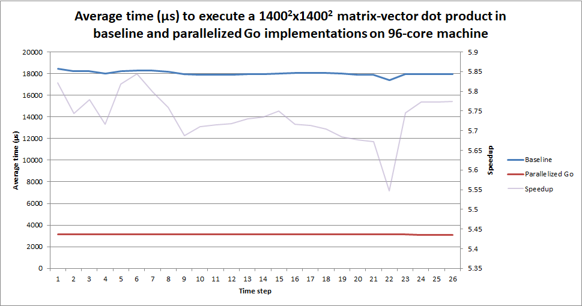
<center> *Fig. 16. Average time to execute mat-vec dot products* </center>

We also briefly thought about a third iteration: right now, we were dividing the rows in ordered blocks, that is goroutine  had the first block of rows, goroutine  had the block of rows just below, and so on. However, not all blocks are as computationally intensive. Some may have more non-zero elements than the others, and so some goroutines could be idle while the last one was still computing. There could be an improvement made in divididing the blocks more equally in terms of workload, as the algorithm is as fast as its slowest member. A heuristic would have been to divide the rows in stripes: goroutine  has the rows `i % 1 == 0`, goroutine  has the rows `i % 2 == 0`, and so on. Due to lack of time, this has not been implemented, and would be part of future work.


## Go - Parallelizing Vector Addition

From initial profiling, we knew that the `pcg` function was a substantial bottleneck. We improved its performance by parallelizing mat-vec products, but we were curious to know if new bottlenecks would arise --- as `pcg` was still the clear bottleneck of our simulation. 


Using the `line_profiler` library in Python, we were able to notice three lines that were oddly intensive, as they together took 65% of the execution time of pcg in a 1500x1500 grid.

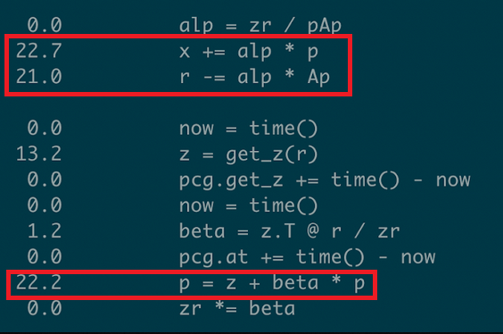

These three lines can be expressed as:
* x = x + alp * p
* r = r - alp * Ap
* p = z + beta * p

Python can be deceptive here: these are not scalar additions, but really vector additions. Only `alp` and `beta` are scalars. They all share a same form: we have a vector multiplied by a scalar, which is then added to another vector. We quickly realized that this could easily be parallelized. Just like for mat-vec products, we partitioned both vectors, each partition being handed to a specific goroutine. Theoretically, with vectors of size  and  goroutines (given  logical cores), we could do this operation in  time. It is not clear if Python is smart enough to do the addition of elements at the same time as the scalar multiplication, so let's not assume that. In the most naïve implementation, the scalar multiplication would happen, then there would be the vector addition, for a theoretical time of . So, a parallelization of this operation could lead to improvements, and indeed, it did (see Fig. X).

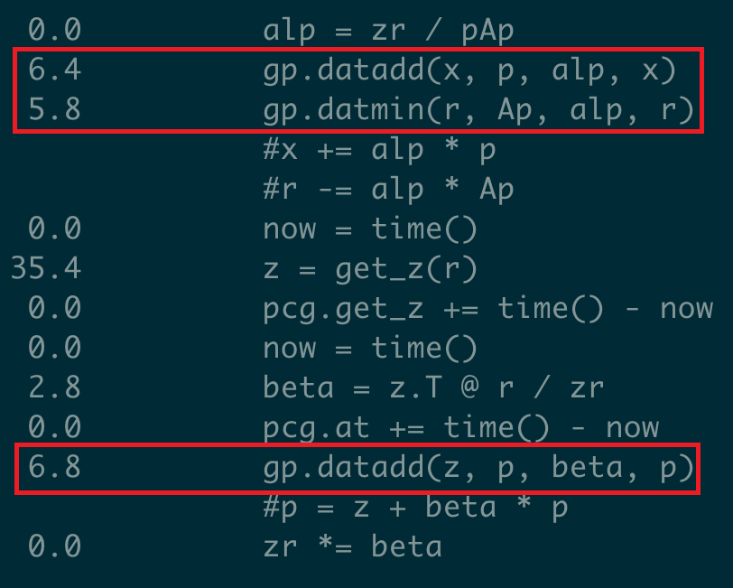

This was a massive speedup for a trivial solution. Rather than take 65% of the time of `pcg` together, they now represented only 19%, so a 66% improvement! At this point, we were wondering if there were other low-hanging fruits to optimize.

## Go - `Empty` vs `Zero`

From looking at the previous profiling results, we realized that the second most expensive call was `{built-in method numpy.zeros}`.  The go implementation was explicitely using `zeros` only once: before calling the go function for the mat-vec product, we initialized an array in Python to hold the results, which go could access and store its results via shared-memory. Numpy `zeros` obviously allocates zeros in a given shape, which probably is  time, assuming an array of length . It came to mind that maybe using numpy `empty` could be more efficient, as the latter does not initialize values, and should therefore technically be  time. To switch to `empty`, however, we had to add one line in the go implementation. When facing an empty row, a goroutine would simply go to the next row via the `continue` keyword. As is, this would mean that empty rows would not result in a  result, but rather in the value that happened to be stored at that memory address at that specific time; hence, the small fix required was to have the goroutine set the value of that result to  before moving on. The intuition was that the values would be set to 0 implicitely in the Go code for no real extra cost, while reducing the initializing cost to the bare minimum, that is the time needed for the OS to allocate memory to Python.

This optimization was not only theoretical, fortunately: it yielded a 30% speedup of the average mat-vec dot product execution time on our local machine with a 1500x1500 grid:

|       | Time () |
|-------|----------------|
| Zeros | 13260          |
| Empty | 9285           |

<center> Fig. 17. Np.zeros vs np.empty execution times </center>


## Go - Distribute workload over the cluster using gRPC

All this work in Go was done on a single node so far. Performance was much improved compared to the baseline, but could it be even better if we could put more machines in parallel to solve mat-vec products? We were skeptic to start with, due to the very small timescale of our problem. Theoretically, yes, putting more machines will solve the problem more quickly, as the time complexity should be , as stated previously (where  is the number of goroutines). However, because operations for 1500x1500 grids are around , the communication and serialization costs were far from negligible. Nevertheless, we had to see for ourselves.

gRPC is Google's flavour of Remote Procedure Calls (RPC), which is a technique to call methods on other machines and possibly other languages as if they were in the same memory space. Inputs and outputs obviously still need to travel over the network; to do so, gRPC's default behaviour, which was used for this project, was to encode this data using protocol buffers (or protobufs). We could have encoded using JSON or XML for instance, but protobufs are meant to be more efficient memory-wise (as it is stored as binary rather than text). The user needs to define the protobufs structure, and gRPC handles the conversion to and from protobufs to the desired programming language's representation of that data. What follows is the protobuf defined for the mat-vec product.

```proto
// The service definition.
service Parallelizer {
  rpc Dot (DotRequest) returns (DotReply) {}
}

// The request message.
message DotRequest {
  repeated int32 indptr = 1;
  repeated int32 indices = 2;
  repeated double data = 3;
  repeated double vec = 4;
}

// The response message.
message DotReply {
  repeated double result = 1;
  int32 offset = 2;
}
```

So now that we have a mean to call distant methods, we can effectively distribute the workload on multiple machines, just like MPI would. The implementation was the following: we would have one master node, and eight worker nodes. The master node is where the script is running; when we need to compute the mat-vec product, the go code is called. However, rather than dispatch throughout its cores, it partitions the matrix for each of the workers. Each worker receives the submatrix as well as the complete vector --- we can't partition the latter ---, computes the result, and sends it back to the master, which assembles back the eight resulting vectors. The master sends only the partitioned matrix to each worker for efficiency; we could have easily send all the workers the whole matrix and tell them which rows to worry about, but that would have very inefficient in terms of networking usage and in terms of serialization to and from protobufs. Each worker behaves just like the single-node implementation: it further partitions its own submatrix to all its goroutines. With  workers (8 in our case), the theoretical runtime should therefore be . However, theory was far from reality in this case.

Indeed, we started by testing the latency between the nodes. To do so, we started two instances in the same subregion, and used `ping <internal_ip>`;  we measured a latency of around . We then tried to send a simple "hello" message using gRPC, and waited until we got back "world" back, and it took around , which is close to the time it already takes to do a 1500x1500 dot product on a single node. This last result was very bad: gRPC had a substantial initial cost, even when the serialization from and to protobufs was pretty straight forward (just two simple strings). We still tried our implementation in order to confirm whether our fears were valid or not.


We tested the implementation on a cluster on AWS with 1 master node and 8 worker nodes: the master was a t2.2xlarge, while the workers were c5.18xlarge instances. The workers are 72-cores rather than 96 on GCP, but have higher clock frequency (base at 3.0GHz and turbo at 3.5GHz, compared to 2.0GHz on GCP). As you can see, for a 1500x1500 grid, the average dot product was taking more than , which is unacceptable for what we need. We compared the results to make sure there was not a bug, but everything was fine; its result was the same as the numpy baseline algorithm.  Hence, we had a functional implementation on a distributed-node setting, but it was abandonned due to its excessive slowness.
  
   
 ## Ctypes implementation in C
Beyond the go implementation, Ctypes were also used to transfer variables between python and C in the hybrid and OMP implementations. With shared libraries the user must specify variable types and dimensions for the variable being passed to C and also declare the values being returned. In initial implementations of the C code, memory leaks were a massive problem as the variable for the return result matrix could not be freed from memory once the program returned the value to the python function. This is due to the fact that the C function would allocate an array onto the heap and return a pointer to it, which Python would translate to a numpy array; it woud be impossible for the C code to then free it, as the script relied on that data allocation. This was problematic, as it led to memory leaks that terminated the program for matrices beyond 200 square units. From this lesson a return matrix of the correct dimensionality was passed to C and the pointer to this value was simply modified from C before returning nothing to the python code. This method was more stable at larger matrix dimensions. 
  
## OMP and Hybrid Implementation
 The first version implemented in C with OMP functionality simply called a python subprocess to run a C script, which was piped back into the python scrip via stdout. As noted earlier, this was not optimal as subprocess calls are less effecient versus using shared libraries and this advantage only grew as the number of calls to the shared libraries grew. Beyond this the ctypes libraries function poorly when they had to declare, allocate memory for, and return the result array for vector addition calls. This did not allow the execution of matrices beyond 200 square units. Once this was remediated the OMP implementation was a matter of including the desired pragma calls sure as: 
  
  ``` pragma parallel for private(i, jh) shared(A, B, ret) schedule(static, chunk)```
  
Such that you can specify the chunks that each thread is taking as well a specifying what variables are shared among the threads and which are private to each individual thread. The results from this were psotivie though not groundbreaking:
  
  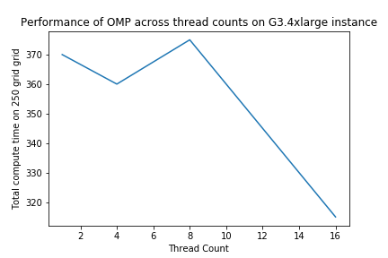

  
Though the performance of the the multithreadied approach is superior to that of the sequential approach the maximal improvement achieved was a modest 1.16x.
  
Beyond the simple OMP implementation we aimed to create and hybrid multithread- multinode approach using both OMP and MPI on several compute nodes as well. This was used the MPI approach with the mpi.h included and mpicc compiler. This was achieved principly achieved using MPI_THREAD_INIT commands with testing performed using rank and size to determine the successful instantiation of the commuting jobs on various nodes. A toy script on this hybrid operation is the following: 
  
```
#include <mpi.h>
#include <omp.h>

int main(int argc, char** argv){
  
  MPI_Init_thread(&argc,&argv, MPI_THREAD_MULTIPLE, &provided);
  int iproc;
  int nproc;
  MPI_Comm_rank(MPI_COMM_WORLD,&iproc);
  MPI_Comm_size(MPI_COMM_WORLD,&nproc);
  
  #pragma omp parallel
  {
    printf("The rank of the process is currently %d  "\n, iproc );
    printf("The size of the process is %d",nproc);
  }
  MPI_Finalize();
  return 0;
} 
```
  
Of note is the fact that versus a normal MPI implementation this requires a MPI_Init_thread rather than an MPI_Init because of the hybrid, multithreading approach. In addition, the arguement MPI_THREAD_MULTIPLE  was also necessary to allow for multithreading within the MPI shcheme. In order to compile this the following command was necessary:
  
```
  mpirun -fPIC -o -shared output.so input.c -fopenmp
```
The arguement fopenmp was necessary to specify omp and the mpicc compiler was needed to compile MPI code. In addition the -shared flag and .so extension wasn necessary for the shared library. In addition, for all of the nodes they need to shared keys and ssh with not just the master node but with each other as per the guide. This implementation was tested on both google cloud and EC2. Results spanning several number of nodes and number of processes and summerized below. Note the y-axis time is in microseconds.  
 
 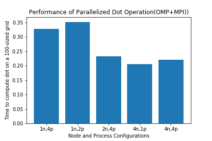
 <center> Fig. 18. OpenMP execution times vs thread count </center>

Note that the performance did increase with the number of nodes but seems to reach a maximum in performance quickly, these operations also also for 100-by-100 square grids. This speed up may not be the case for larger-sized grids where the sequential process of data transfer is a bottleneck as was the case with gRPC. 
  
 ## GCP vs AWS

For all of the implementations both google cloud and AWS were used and the group came to the consensus that Google's service is easier to interface for several reasons. For one, Google's service allowed the user to login using their google account rather than having to store (and potentially delete) a key .pem file. In addition, Google's service allowed for the specific modulation of computing resources (cores, memory, storage, GPUs) in addition to the attachment/detachment of GPUs by simply restarting a VM. With AWS, there was also no clear indicator of how much instances cost, there were also different dashboards for each region which made it possible to leave an instance running on a different region and forget about it. Two of the group members had a good deal of experience with both the services but the remaining member who learned how to run instances on both services found the learning curve on Google cloud to be much shallower. 

  
 # Roadblocks

While we attempted to implement the proposed architecture without changes, some changes were necessary given the constraints of the technologies we were using.

## Language 
One of the first problems we faced in the entire project was realizing that the easy implementation of the code we had in python would need to be converted to C in order to properly speed up and make use of the design principles from the course. The implementation of a simple python multiprocessing version of the script made this clear as most of the python code used wrapper functions for latent C code or was interdependent and thus made a parallelized version of the code impossible without a lower-level implementation. The performance from multiprocessing is summarized below:
  

The difference in performance between python and lower-level implementations also resulted in boosts in speed as we saw that simply reimplementing the dot product algorithm in C yielded performance approaching numpy for a 250 x 250 grid. 


|Implementation| Mean Dot product Length(250 x 250 grid)|
|-------------------|----------------|
|Numpy| 0.000551|
|Non-Parallel C|0.002231|

<center> Fig. 19. Dot-prodcut vector length </center>

## PyCuda

As mentioned before, the runtime of a dot product is fairly short (<10000 on a 1500 x 1500 grid). Thus, any attempt to parallelize will have to ensure that the communication overhead is not too significant. However, when PyCuda is invoked, it must copy over the data from the main memory to the GPU memory before the operation can be executed. We knew from experience that sending data via the PCIe bus to the GPU was going to be a serious bottleneck. Given the In order to valide our conjecture, the transfer times of various grid sizes were tested on an AWS g3 instance (see PyCuda branch for specifications). These results are tabulated below for a .004% non-zero elements matrix:

| Grid Size (n x n) | Time () | % of Matrix-Vector Dot |
|-------------------|----------------|------------------------|
| 64                | 401677         | 4463                  |
| 150               | 425736        | 4730                 |
| 300               | 3107930       | 34533                |

<center> Fig. 20. PyCuda Transfer times </center>

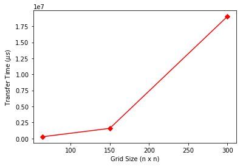
<center> Fig. 21. PyCuda Transfer times </center>


As can be seen above, the transfer time far outweighs the time of an operation, resulting in a slowdown for the operation.Thus, PyCuda was abandoned as a possible implementation.


## Latency

Similar to above, multi-node architectures had to be abandoned due to latency resulting in too great of an overhead. Using a cluster of 8 c5 worker instances and one t2 master instance (see gRPC-buffer branch for specifications), gRPC was tested but quickly abandoned. With a latency of about 3000  on a 1080x1080 grid, the latency was significant. Further testing revealed that the average matrix-vector dot product on a 1500x1500 grid was 2184293 :

|      | Time () | % of Matrix-Vector Dot |
|------|----------------|------------------------|
| gRPC | 2184293        | 24,269                 |

<center> Fig. 21. gRPC Dot product execution time </center>

## Memory Error

After approximately 13 hours of real time and approxiamtely 375 hours of compute time on a GCE instance (see gRPC-buffer branch for specifications), the run failed to generate a 1600x1600 simulation over 6,000 time steps because a **MemoryError** was thrown. In order to generate the movie, the array of grids is copied for rendering. This means that what was a 3D array of around 130GB essentially doubles, resulting in far more memory being used than we expected. We had 300GB of RAM at the time, which should have been enough to handle this increase. However, we believe that some other memory from the generation part of the algorithm (before rendering) had not been freed yet. Python being a garbage-collected language, it is much more difficult to free memory. At this point in the process the leaking memory should have been freed (as it was out of the lexical scope), but it seems like it was not yet. As such, we increased the memory to a 600GB total. This was definitely overboard --- the subsequent run showed that the peak reached was near 330GB ---, but the little difference in terms of cost made it feel like a safe bet. If we were to run this again, we could request less memory, as we would be more confident of its reasonable range of usage.

In order to prevent the need to rerun in the event of a failed render, we also wrote the array to disk before rendering. By default on GCP, compute engines are assigned 10GB of disk storage (can be HDD or SSD, for an extra cost); to satisfy the need to store 130GB to disk, we had to request the corresponding amount of non-volatile storage. To be further certain not to miss storage this time --- as we were not sure how efficient the encoding to disk would be --- we in fact requested 200GB.

## Node Permissions
With the multinode implementations the issue of latency was discussed above but also permissions were a large problem with MPI in particular. MPI often threw a ```Permission Denied (Public Key) ``` error which was not a result of not copying over sshkeys from the master to the nodes. It was later discovered that MPI launch structure is a tree implementation where nodes started up MPI threads in other nodes, not necessarily the master node. Practically this meant that keys needed to be shared among the nodes and well as the ssh login sessions in order for the nodes to be added to the trusted ip addresses of each other. This problem was not present in the original infrastructure guide as that implementation simply had 2 nodes but we scaled to 4 instances.   
  

## Future Work
Future implementions would seek to optimize over 3D grids in particular as scaling for these grids follows as  and is still difficult to simulate even with this implementation. In addition it would be interesting to store the charge values of spatial points and how they interact with lightning dispersion as the current algorithm does not store the state space of charge beyond the the lifespan of a single bolt. This would be interesting to determine how bolts interact with each other and how local variations in charge affect the simulation. 


* other parts to parallelize (mat-mat products not done)
* optimize further would probably require another algorithm?
* render the frames to the movie as we go, so we do not need as much memory at once; as well, this could end being faster, as there is less stress on memory usage, and rendering would be parallelized

# Appendix/References
 
[1] V.A. Rakov. Fundamentals of Lightning. Cambridge University Press, 2016.                                                                                      
[2] L. Niemeyer, L. Pietronero, and H. J. Wiesmann. Fractal dimension of dielectric breakdown. Physical Review Letters, 52(12):1033–1036, mar 1984.                                                                                                                                                                   
[3] T. Kim, J. Sewall, A. Sud, and M. Lin. Fast simulation of laplacian growth. IEEE Computer Graphics and Applications, 27(2):68–76, mar 2007		
[4] T. Kim and M. Lin. Fast animation of lightning using an adaptive mesh. IEEE Transactions on Visualization and Computer Graphics, 13(2):390–402, mar 2007.											
[5] Timothy A. Davis and William W. Hager. Row modifications of a sparse cholesky factorization. SIAM Journal on Matrix Analysis and Applications, 26(3):621–639, jan 2005.									
[6] J.W. Demmel. Applied Numerical Linear Algebra. Other Titles in Applied Mathematics. Society for Industrial and Applied Mathematics (SIAM, 3600 Market Street, Floor 6, Philadelphia, PA 19104), 1997. 				
[7] Costas Sideris, Mubbasir Kapadia, and Petros Faloutsos. Parallelized in-complete poisson preconditioner in cloth simulation. In Motion in Games, pages 389–399. Springer Berlin Heidelberg, 201

